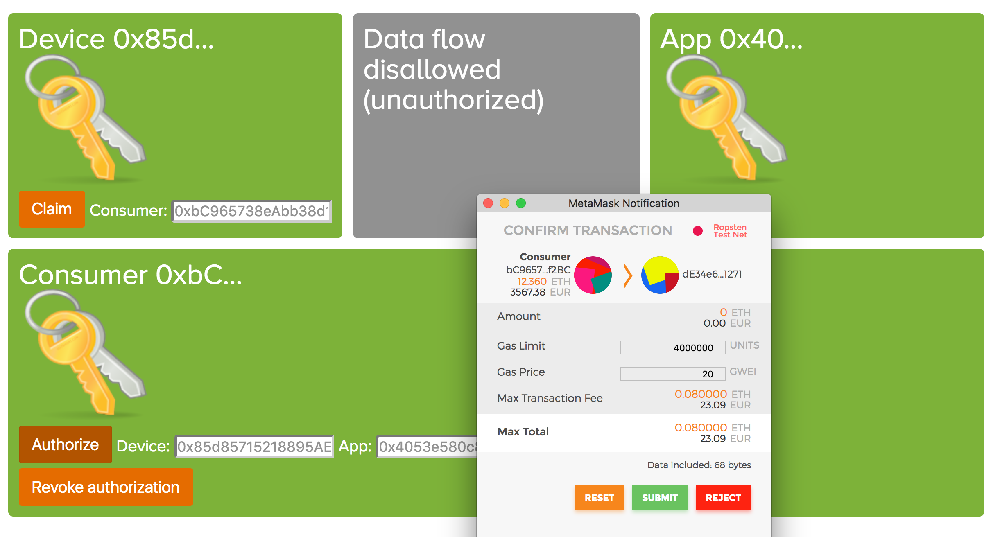

# decentralized-auth

A prototype to test the authorization of energy data flows using Ethereum smart contracts.

The ClojureScript architecture uses [re-frame](https://github.com/Day8/re-frame).


## Development Mode

### Start Cider from Emacs:

Put this in your Emacs config file:

```
(setq cider-cljs-lein-repl "(do (use 'figwheel-sidecar.repl-api) (start-figwheel!) (cljs-repl))")
```

Navigate to a ClojureScript file and start a figwheel REPL with `cider-jack-in-clojurescript` or (`C-c M-J`)

### Run application:

```
./compile-solidity
lein clean
lein figwheel dev
```

Figwheel will automatically push cljs changes to the browser.

Wait a bit, then browse to [http://localhost:3449](http://localhost:3449).

#### Auto-compile solidity Smart Contracts:

```
lein auto compile-contracts
```

## Usage

The prototype expects a web3.js object provided, for example via by the Chrome extension [MetaMask](https://metamask.io/). And to interact with the smart contract, two accounts are necessary:

- Data Provider
- Prosumer

And a Service Provider needs an address, but in the current prototype this does not need to exist.

The Data Provider can be claimed with the address of the Prosumer, then the Prosumer can authorize the Service provider to access the Data Provider.

To follow the flow change accounts in MetaMask and respectively click the buttons for Claim (as a Data Provider) and Authorize or Revoke (as a Prosumer), then login as the Data Provider again and see the data flow change.



## Production Build

To compile ClojureScript to JavaScript:

```
lein clean
lein cljsbuild once min
```
