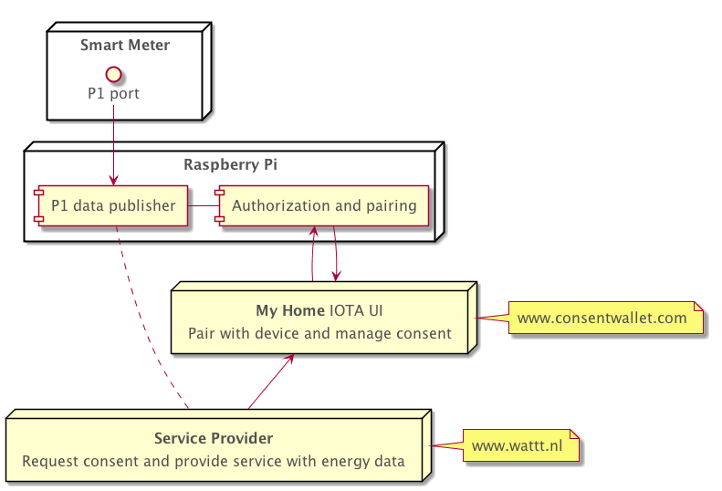

# Energy usage data streams with consent of device owner Proof of Concept

Sharing high frequency smart meter data with explicit consent of the consumer will help the energy transition in the Netherlands. This Alliander R&D project investigates the use of the distributed ledger IOTA and Masked Authenticated Messaging (MAM) for decentralized energy data streams adhering to the GDPR privacy regulation.

## Goals

- User is in control of his data
- A level playing field is created where service providers (e.g., app developers) can use the data
- Adheres to GDPR by asking for goal and consent
- Decentralized consent management via [IOTA MAM](docs/technologies.md#iota-mam)
- Post-quantum cryptography (signing via [IOTA Kerl](docs/techologies.md#iota) and asymmetric encryption via [NTRU](docs/techologies.md#ntru))

## Components



* Smart Meter: Dutch Smart Meter with a high frequency energy data port (P1 port).
* [Service Provider Wattt Insights](service-provider): An example of a service provider that graphs energy usage data and interfaces with My Home.
* [Raspberry Pi energy data reader](raspberry-pi-client): A Raspberry Pi that is connected to a Dutch smart meter's P1 port (with high frequence energy data) via a USB to RJ11 cable.
* [My Home](my-home): A frontend that interfaces with the IOTA backend where users can:
  1. Pair with one Raspberry Pi
  1. Give consent for service provider to access data
  1. Revoke consent of service provider to access data

## Cloning

```
git clone git@github.com:Alliander/decentralized-auth.git
cd decentralized-auth
```

## Running locally

Install [Docker](https://www.docker.com/community-edition) and [Docker Compose](https://docs.docker.com/compose/install). Use node version 8.6. Then run:

```
docker-compose up
```
For running the components individually:

Set environment variables:
```
export IOTA_PROVIDER=xxxxxx # when not running local-testnet
export MIN_WEIGHT_MAGNITUDE=14
```

Start My Home consent management backend (which serves the frontend as well):

```
cd my-home/backend && npm start
```

Start Service Provider wattt.nl backend (which serves the frontend as well):
```
cd service-provider/backend && npm start 
```

Start the Raspberry Pi client locally with a fresh seed.

```
cd raspberry-client 
SEED=$(cat /dev/urandom | LC_ALL=C tr -dc 'A-Z9' | fold -w 81 | head -n 1) npm start
```
When connecting a RJ11 cable to USB ensure the `P1_SERIAL_PORT` environment variable is set to its USB serial port.

See the separate projects's READMEs for more information.

## Production

Run the [raspberry-pi-client](raspberry-pi-client) on a Raspberry Pi connected with a smart meter using a PJ11 cable.  
Deploy [my-home](my-home/backend). An example runs at [www.iotahome.nl](https://www.iotahome.nl).  
Deploy [service-provider](service-provider/backend). An example runs at [www.wattt.nl](https://www.wattt.nl).  

## Further information

- [A description of the architecture](docs/architecture.md)
- [The scenarios (pairing with a device, giving consent, revoking consent)](docs/scenarios.md)
- [The technologies used](docs/technologies.md)
- [The advantages and disadvantages of using IOTA for GDPR proof energy data streams](docs/advantages-and-disadvantages.md)
- [And issues we are aware of](docs/known-issues.md)

## Contributing

We are very happy if you can create issues (also for suggestions) or pull requests.

## License

© 2018 [Alliander](https://www.alliander.com)  
This project is licenced under [Apache 2.0](LICENCE).
