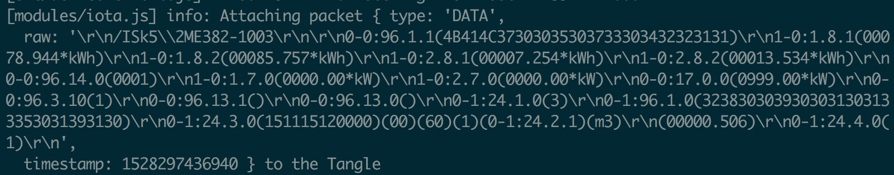
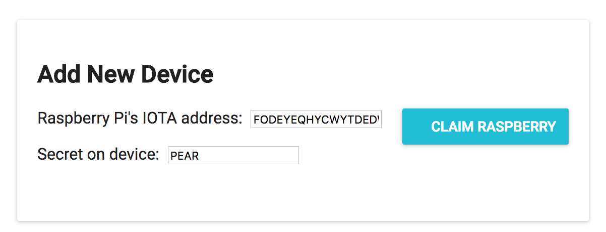
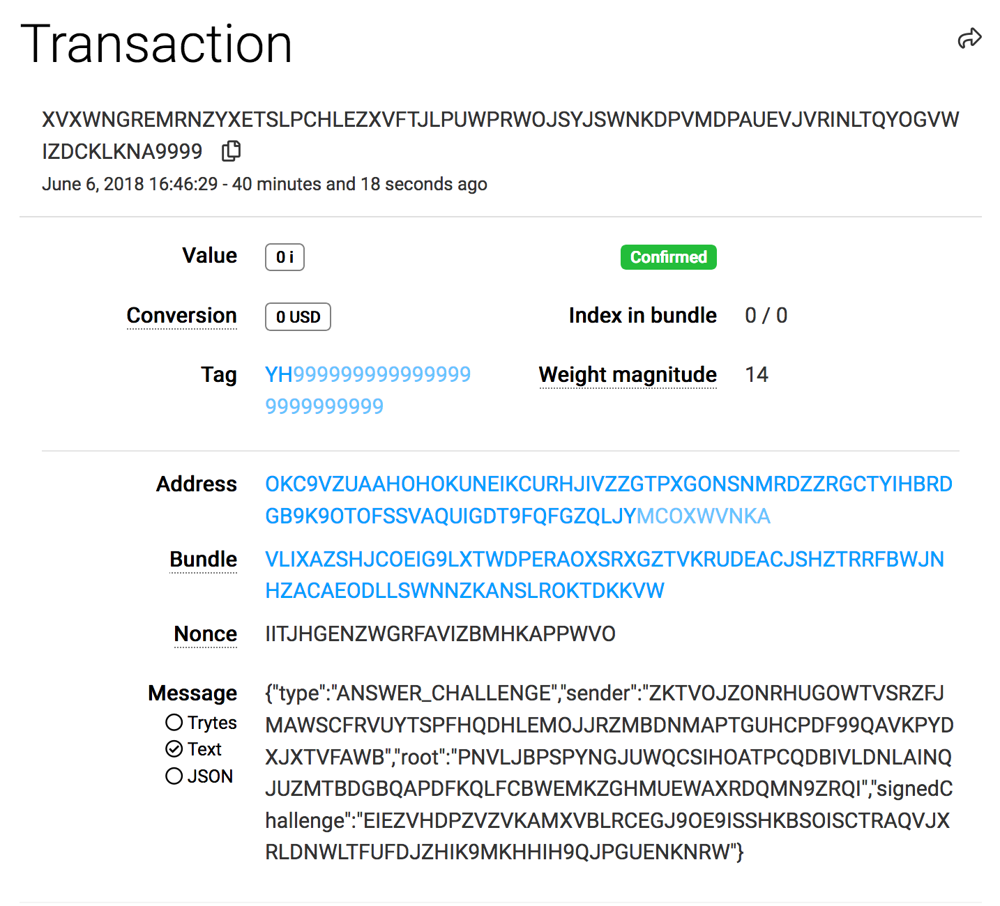
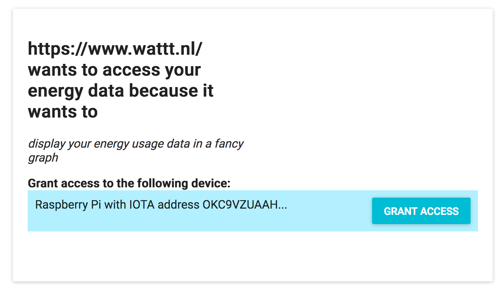
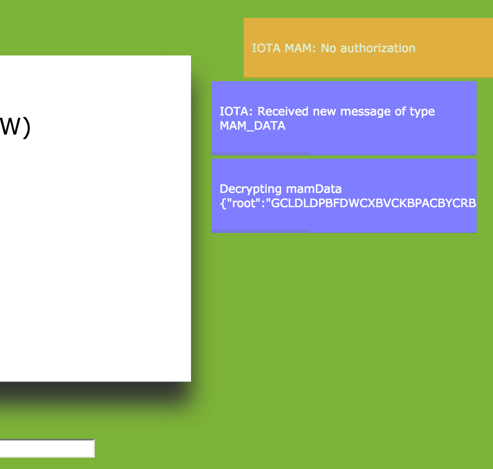
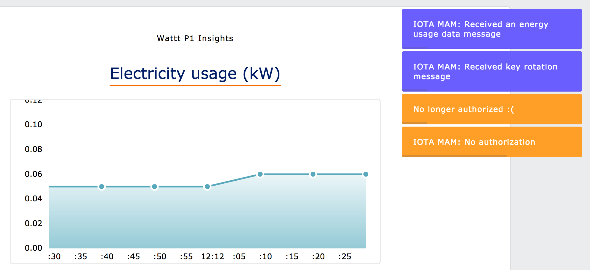

# Scenarios

This document describes the various scenarios.

## Publishing data

Once the Raspberry Pi running the software is connected to a Dutch smart meter it starts publishing the data. A device publishes data when a P1-telegram is received on the `P1_SERIAL_PORT` environment variable.


If you run the raspberry-pi-client yourself make sure the `SMART_METER_VERSION` environment variable is set to your smart meter version, so that the correct settings will be used.

Note that an IOTA node needs to be specified that does the proof-of-work for you, it's too much work for the Raspberry Pi. If you have that, the [`serialport`](https://www.npmjs.com/package/serialport) npm module and the [mam.client.js](https://github.com/iotaledger/mam.client.js) its quite simple to publish all data telegrams from the P1 port to a restricted MAM channel:

```
const SerialPort = require('serialport'); // version 4.0.7
const IOTA = require('iota.lib.js'); // version 0.4.7
const MAM = require('mam.client.js'); // github.com/iotaledger/mam.client.js.git

// Get IOTA seed and IOTA provider from environment variables
const iota = new IOTA({ provider: process.env.IOTA_PROVIDER })
const seed = process.env.SEED;
const securityLevel = 2;

let mamState; // mutable variable to hold the MAM state (manages for example the
              // new root to publish the next message on)

const state = MAM.init(iota, seed, securityLevel);
MAM.changeMode(state, 'restricted', 'SOMESIDEKEY');
const mamState = state;

// In this example we use configuration for smart meter version 2.2
const p1Config = {
  baudrate: 9600,
  databits: 7,
  parity: 'even',
};

const RASPBERRY_PI_USB_PORT = '/dev/ttyUSB0';
const TELEGRAM_SEPARATOR = '!';

const serialPort = new SerialPort(RASPBERRY_PI_USB_PORT, {
  ...p1Config,
  parser: SerialPort.parsers.readline(TELEGRAM_SEPARATOR),
});

serialPort.on('data', telegram => {
  const packet = { type: 'DATA', timestamp: Date.now(), raw: telegram };
  const trytes = iota.api.toTrytes(JSON.stringify(packet));
  const { state, payload, root, address } = MAM.create(
    mamState,
    trytes,
  );
  mamState = state;
  console.log(`Attaching packet ${JSON.stringify(packet)} to the Tangle`)
  MAM.attach(payload, address);
}

// Omit error handling and retrying
```

So this way every P1 telegram that arrives on the USB port is published to the restricted MAM channel. When someone else knows the root and side key the stream can be fetched using `MAM.fetch(root, mode, sideKey)`. In the [Giving Consent](#giving-consent) scenario below it is explained how the root and side key is communicated to a service provider you have given consent.



<sub>*Data (raw P1 telegram) is published to a restricted MAM channel*</sub>

Note that publishing data on MAM only works on the IOTA testnet and for smart meters that have a frequency of one message every 10 seconds. All nodes I've seen are too slow to publish data every second on testnet, and on mainnet they take around 40 seconds for an MAM message. So [till faster processors for IOTA proof-of-work arrive](https://iotanodes.org/jinn/), you have to add code to drop 39 in 40 messages on mainnet and 9 in 10 messages on testnet for a meter that publishes one telegram every second. If the PoW speed does not improve the only option for this use case is to switch to an off-Tangle protocol for data transfer like [MQTT](https://www.wikipedia.org/mqtt).

## Pairing with a device

To get a Raspberry Pi to listen to you, in this solution, you need to proof that you have seen the secret that is on the device. 

For this investigation a goal was to have all communication via the IOTA Tangle. Because this is public communication, showing that you know the secret takes a few steps. Otherwise an attacker can also determine the secret and claim your device.

So on the My Home UI to pair with a device its address and secret needs to be entered (this would be more convenient via a QR code, but for now we enter them by hand):



<sub>*When adding a Raspberry Pi in My Home its IOTA address and secret (in this case the secret is "PEAR") needs to be entered.*</sub> 

When the button is pressed the device receives a `CLAIM_DEVICE` message on its IOTA address. The device will respond with a `CHALLENGE` that needs to be signed with the secret on the device. My Home signs the challenge with the provided secret using Kerl hashing and returns this along side its root of its private MAM channel in a `ANSWER_CHALLENGE` message. If the signed challenge is valid the device starts listening to the MAM root and returns with a `CLAIM_RESULT` of "OK". My Home then publishes a `DEVICE_ADDED` event on its private MAM channel so it can always retrieve this.


<sub>*Sequence diagram pairing My Home with Raspberry Pi*</sub>

All these messages are also visible via the IOTA Tangle explorer when searching for the Raspberry Pi's IOTA address:



<sub>*The message of type ANSWER_CHALLENGE containing the signed challenge is send to the Raspberry Pi*</sub>

When the Raspberry Pi is paired it will start listening to My Home's MAM channel, where the events `AUTHORIZED` and `AUTHORIZATION_REVOKED` will be published when a user gives or revokes consent to a service provider to access the energy usage data.

### Giving consent

The goals of giving consent to a service provider are:

1. Communicating the MAM root and side key of the Raspberry Pi's MAM channel to the service provider
1. Storing the authorization somewhere so that the service provider and device owner can point to it


<sub>*Sequence diagram for giving consent to a service provider to access data of paired Raspberry Pi P1 reader*</sub>

When a user is on a Service Provider (for example [www.wattt.nl](https://www.wattt.nl)) that works with My Home data access (with consent) can be requested. If for example a button is clicked the service provider redirects to `iotahome.nl/new-policy` with the following query string parameters:

- iotaAddress: the IOTA address
- publicKeyTrytes: tryte-encoded public key of NTRU key pair
- goal: the goal for the data access
- url: the URL to redirect to

Then in My Home the user can review this and select a device (fetched from My Home's private MAM event stream) to give access to.

Note: requesting data access consent could be made more generic by specifying the type of data a service provider is interested in. For now P1 Energy Data is the only supported format.



<sub>*In My Home's consent management UI a paired device can be selected*</sub>

When "Grant Access" is clicked an `AUTHORIZED` event will be published on the MAM stream. This message contains a consent policy with the information of the service provider, the device, what it can do with the data of the device, and the goal. The user will be redirected to the service provider once the event is attached to My Home's private MAM channel.

Because the Raspberry Pi listens to this My Home's MAM event stream it will see this event. When it sees the event it will process the message. The Raspberry Pi software will retrieve the `serviceProvider` from the policy in the event, store the `serviceProvider` in a set containing all authorized service providers, and send the MAM root and side key (encrypted with the public key) to the service provider's IOTA address. This means a service provider can access data from the current moment, and not earlier.

```
/**
 * Process MAM message for added authorization.
 * @param message {Object} MAM message of type {@link AUTHORIZED_TYPE}.
 * @returns {undefined}
 */
processAuthorizedMessage(message) {
  const { serviceProvider } = message.policy;
  logger.info(`Authorizing service provider ${JSON.stringify(serviceProvider)}`);
  this.authorizedServiceProviders.add(serviceProvider);
  this.sendMamData(this.seed, serviceProvider.iotaAddress, serviceProvider.publicKeyTrytes);
}
```

Below `sendMamData` encrypts the current side key and root with the service provider's public key, so that only the service provider can decrypt it later:

```
/**
 * Send encrypted MAM data to a service provider.
 *
 * @function sendMamData
 * @param {string} seed IOTA seed of sender
 * @param {string} address IOTA address of the service provider
 * @param {string} publicKey Public key of the service provider in trytes
 * @returns {Promise} containing IOTA transactions with this message
 */
async sendMamData(seed, address, publicKey) {
  const { channel: { side_key, next_root } } = this.mam.getMamState();
  const encryptedMamData = {
    root: ntru.encrypt(next_root, publicKey),
    sideKey: ntru.encrypt(side_key, publicKey),
  };

  logger.info(`Provide service provider ${address} with MAM data ${JSON.stringify(encryptedMamData)}`);

  const message = { type: MAM_DATA_TYPE, root: this.myHomeRoot, mamData: encryptedMamData };
  return iota.send(seed, address, message);
}
```

My Home's root is also send along. So that the service provider, Raspberry Pi, P1 Reader and My Home share the immutable audit trail of consent events. Because they all are all given access to My Home's private MAM channel, they can all proof if and when data was accessible or not.

The service provider then decrypts the MAM root and side key and can start fetching energy data:



<sub>*The service provider receives the MAM data (root and side key) from the device and decrypts it*</sub>

Maybe a user has authorized many service providers to access its data. What if a user wants to revoke the consent for one of these?

### Revoking consent

A user can revoke consent under Policies in My Home. This starts the following sequence:


<sub>*Sequence diagram for revoking consent to a service provider to access data of paired Raspberry Pi P1 reader*</sub>

As can be seen, when a user revokes a policy, an `AUTHORIZATION_REVOKED` message is added to My Home's event stream. The Raspberry Pi fetches this message, creates a new side key, removes the service provider from the set of authorized service providers, and informs the still authorized service provider of the new side key.

The latter is done by encrypting the side key with the public keys of the service providers, and adding it to a `KEY_ROTATION` message. This message is then added to the MAM stream. 

Still authorized service providers fetch this from the MAM stream and can decrypt the new side key. The no longer authorized service provider does see the message, but cannot decrypt it. That service provider can no longer fetch new energy data.



<sub>*The service provider shows plots earlier received data, but is not included in the KEY_ROTATION message, so is no longer authorized and is unable to fetch new data*</sub>

## Deleting a device

When a device (raspberry-pi-client) is deleted a message with type `DEVICE_DELETED` is published on the MAM channel of My Home. This way My Home knows to no longer display the device, and the raspberry-pi-client knows that it should revoke all current authorizations.

